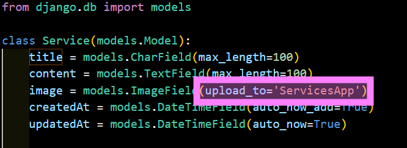
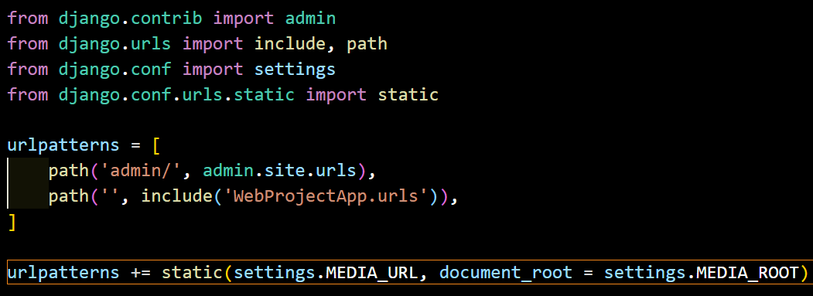

# Django Web Project

## Contenidos

### 1. Conceptos importantes

#### Apps en Django

Cuando queramos crear una app debemos utilizart este comando:

```batch
python manage.py startapp <project-name>
```
Siempre que se crea una `app`, debemos:

- Dejarla registrada en el archivo `settings.py` del proyecto principal, dentro de _INSTALLED_APPS_.

#### 1.1. Mapeo ORM (Object-Relational Mapping) - Models

El mapeo ORM (Object-Relational Mapping) en Django es un concepto clave que permite interactuar con bases de datos relacionales utilizando languaje Python en lugar de escribir SQL. ORM actúa como una capa de abstracción entre la aplicación y la base de datos, facilitando el manejo de datos.

Cada **`model`** de Django contienen una clase que contiene atributos. Los atributos corresponden a cada uno campo de los campos que contiene una tabla. Cada `model` es una clase de Python que hereda de django.db.models.Model.

Django además, te proporciona una API de acceso a la base de datos que se genera de manera automática.

Recuerda ejecutar el comando de las migraciones siempre que crees, modifiques o elimines un modelo. Este comando detecta los cambios en los modelos y genera archivos de migración. Estos archivos describen cómo deben aplicarse estos cambios a la base de datos. Sin las migraciones, los cambios en el código no se reflejarán en la base de datos.

```batch
python manage.py makemigrations
python manage.py migrate
```

[Información sobre Modelos en Django](https://docs.djangoproject.com/en/5.1/topics/db/models/)


#### 1.2. Archivos multimedia

Django no está preparado, en modo desarrollo, para servir archivos multimedia. Además, esos archivos se quedan guardados en la raíz del proyecto sin orden ninguno.

Pasos a seguir. 

1. Para tener todo de manera más organizada, se ha creado un archivo en el proyecto llamado `media` que enrutaremos para que Django guarde todos los archivos que correspondan.

2. En el archivo `setting.py`, justo debajo de la constante `STATIC_URL = 'static/'` añadiremos lo siguiente:

```batch
MEDIA_URL = 'media/'
MEDIA_ROOT = BASE_DIR / 'media'
```
`MEDIA_URL` es la url pública para los archivos media.
`MEDIA_ROOT` indica dónde tiene que ir a buscar los archivos multimedia.

Dentro de la carpeta `media` crearemos más subcarpetas para guardar los archivos de cada app en su directorio correspondiente.

En nuestro caso, para permitir subir un archivo multimedia desde el panel de administrador, lo hemos indicado en el siguiente archivo:

`WebProject\ServicesApp\models.py`

En este caso, se ha indicado en el atributo `image` de la clase `Service`.



3. En el siguiente archivo `WebProject\WebProjectApp\urls.py` registreremos la url pública para que la tenga como url de búsqueda y muestre su contenido cuando se solicite. 

Importaremos los archivos `settings.py`y `static` y agregaremos lo siguiente:

```python
urlpatterns += static(settings.MEDIA_URL, document_root = settings.MEDIA_ROOT)
```



### 1. Creación del proyecto

Creación del proyecto. Un proyecto puede contener una o varias aplicaciones.

```batch	
django-admin startproject WebProject
```

Nos movemos hacia la carpeta y creamos la apliación. Una aplicación se puede utilizar en diferentes proyectos.

```batch
python manage.py startapp WebProjectApp
```

Comprobamos que funciona el servidor.

```batch
python manage.py runserver
```

Es posible que te pida el siguiente comando.

```batch
python manage.py migrate 
```

### 1. Estructura del proyecto

#### Panel de Administración

Para entrar al panel de administración de Django solo necesitas añadir `admin` a la ruta de tu servidor.

> 127.0.0.1:8000/admin

Encontrarás un formulario de logueo. Crea el usuario y la contraseña introduciendo este comando en la consola y siguiendo las indicaciones:

```batch
python manage.py createsuperuser
```

A continuación introduce los datos.


En caso de olvidar la contraseña usa este comando:

```batch
python manage.py changepassword <username>
```

#### Web Project
- `settings.py`. Debemos incluir un registro de cada una de nuestras apps.
- `urls.py`. Apunta al archivo de mismo nombre de cada una de las aplicaciones que pueda tener el proyecto. Es una forma de tener organizadas las urls. 

#### Web Project App
- `urls.py`. Contiene solo las urls de esta aplicación. 
- `views.py`. Creación de todas vistas. 

#### Services App
App destinada a la parte de `servicios`. De esta forma podremos acceder también desde el panel de administración y así modificarlo.

#### Blog App
App destinada a la parte de `blog` para poder insertar noticias. Las entradas del blog tendrán categorías. 